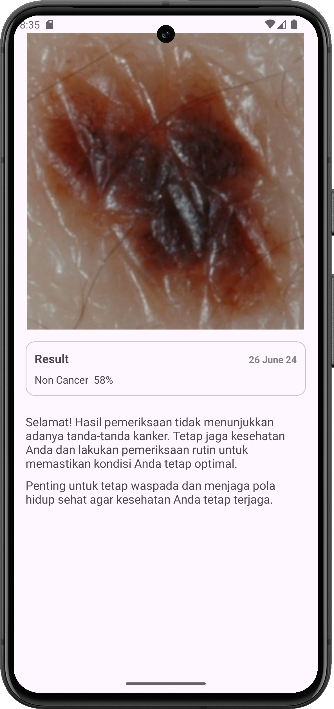
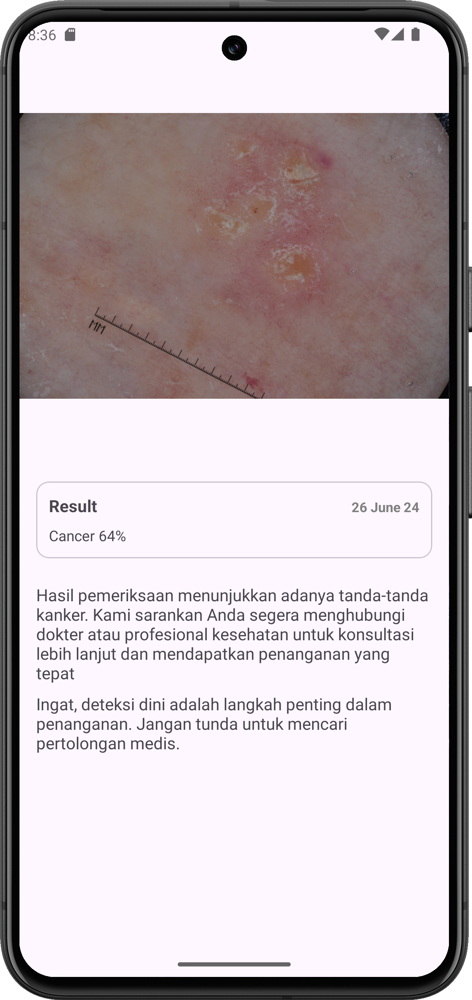
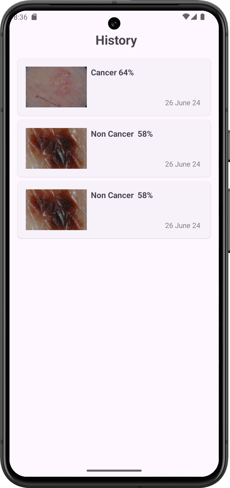
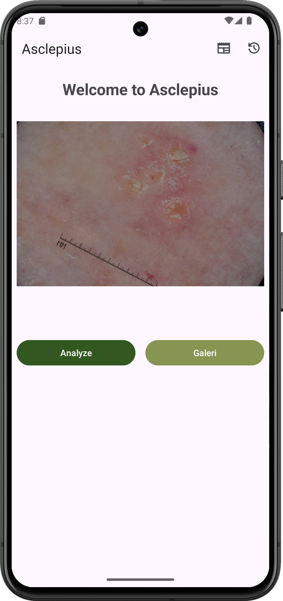

# **Cancer Detection** 

This repository is the final project for the Belajar Penerapan Machine Learning untuk Android course at Dicoding. This application purpose to help users detect whether they have cancer or not.  
 

# Application Install

***You can Install and test latest Next Hotel app from below 👇***

## Getting started
- Prerequisites
  - Android

- Installation
  - Download the APK
  - Install the APK

## Setup
Clone the repository on your machine. Open the project on your IDE and run it.
 
## Built With 🛠
- [Kotlin](https://kotlinlang.org/) - First class and official programming language for Android development.
- [LiveData](https://developer.android.com/topic/libraries/architecture/livedata) -  oOservable data holder class.
- [Android Architecture Components](https://developer.android.com/topic/libraries/architecture) - Collection of libraries that help you design robust, testable, and maintainable apps.
    - [ViewModel](https://developer.android.com/topic/libraries/architecture/viewmodel) - Stores UI-related data that isn't destroyed on UI changes.
    - [ViewBinding](https://developer.android.com/topic/libraries/view-binding) - Generates a binding class for each XML layout file present in that module and allows you to more easily write code that interacts with views.
- [Retrofit](https://square.github.io/retrofit/) - A type-safe HTTP client for Android and Java.
- [GSON](https://github.com/google/gson) - A modern JSON library for Kotlin and Java.
- [GSON Converter](https://github.com/square/retrofit/tree/master/retrofit-converters/gson) - A Converter which uses GSON for serialization to and from JSON.
- [Material Components for Android](https://github.com/material-components/material-components-android) - Modular and customizable Material Design UI components for Android.
- [Tensorflow Lite for Android](https://www.tensorflow.org/lite/android?hl=id) - TensorFlow Lite is a lightweight version of TensorFlow that allows running machine learning (ML) models in Android applications.

 ## 📸 Screenshots
||||
|:----------------------------------------:|:-----------------------------------------:|:-----------------------------------------: |
|  |  |  |
|  |  | 
